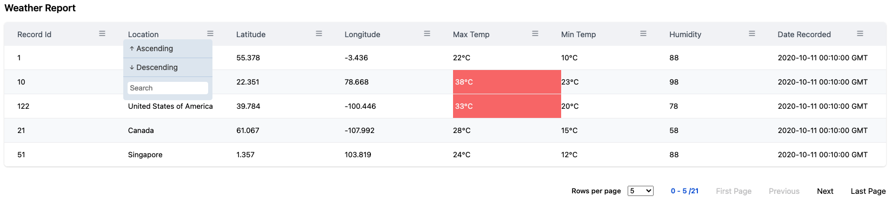

# React Datatable
This is another datatable library for react application.

*If you are looking for simple react datatable with some in built functionality like pagination, sorting, progress bar etc. or full customization of these components and granular access to the table elements for any CSS framework like tailwind, bootstrap or just css or scss of your choice, then this is the datable library you are looking for. Give this React Datatable a try.*
<br>
<br>
## Table of contents

1. [Demo and Example](#Demo-and-Example)
2. [PNG View](#PNG-View)
3. [Key Features](#Key-Features)
4. [Requirement / Dependency](#Requirement-/-Dependency)
5. [Installation](#Installation)
6. [API](#API)
    - [Basic Table API](#Basic-Table---interface-IDataTableProps)
    - [Column API](#Columns---interface-IColumn)
    - [Options / Properties](#Options-/-Properties---interface-IDataTableOptions`)
        - [Basic](#Basic)
        - [Pagination](#Pagination)
        - [Sorting](#Sorting)
        - [Progressbar](#Progressbar)
    - [Styling](#Styling)
7. [Code Examples](#Code-Examples)
8. [Development](#Development)
    - [Setup](#Setup)
    - [Local Development](#Local-Development)
    - [Build](#Build)
    - [Test](#Test)
9. [Contributors](#Contributors)

## Demo and Example
<hr>

[Click here for Live Demo with Storybook](https://sangramthecoder.github.io/@react-datatable-stories)

## PNG View



## Key Features
<hr>


* Simple to install
* Easy customization with tailwind, bootstrap 5, vanilla css, scss.
* In Built Pagination, sorting functionality.

## Requirement / Dependency
<hr>

React framework `>=16.8.0`

## Installation
<hr>

`npm -i @react/datatable`

# API

## Basic Table - `interface IDataTableProps`
Property | Type | Default | Description/Example
-------- | ---- | ------- | -------------------
columns | `IColumn` | | **Mandatory Props**<br>*Column defination for the table.*<br> Please check [Columns](#Columns---interface-IColumn) | 
data | `any` | | **Mandatory Props**<br>*Data of you choice* | 
options | `IDataTableOptions` | | *Props for table configuration. Use various options to customize your table.*<br>Please check [Options / Properties](#Options-/-Properties---interface-IDataTableOptions`) for details options available for react datatable configuration| 
classNames | `IDataTableCSS` | | *Props for table styling configuration. Use various options to customize your table css.*<br>Please check [Styling](#Styling) for details css options available for react datatable configuration| 

<br>

## Columns - `interface IColumn`
Property | Type | Default | Description/Example
-------- | ---- | ------- | -------------------
name | `string` | | **Mandatory**<br>*Name of the column to be displayed in table* |
selector | `string` | | **Mandatory**<br>*Id of the column that matches your data object keys*|
sortable | `boolean` | | *Toggle switch to make a column sortable or not*<br>*Expected Value `true` or `false`*<br><br>**`sortable : true`**|
customSortIcon | `React.FC<{selector: string,isHeaderClicked :boolean, onSortClicked: (asc : boolean, event: React.MouseEvent<Element, MouseEvent>) => void, prevDirection : Sorting, isHeaderHovered: boolean, onSearch : (searchData : string, selector : string ) => void }>` | | *React functional component for custom sort icon for your column. You can define your custom icon components of your choice.* |
showColumn | `boolean` | | *Toggle switch to show a column or not in table*<br>*Expected Value `true` or `false`*<br><br>**`showColumn : true`** |
customCell | `React.FC<{ row: any }>` | | *Full control over cell customization with custom React functional component* |
customCellStyles | `CellStyleCustom[]` | | *Array of your custom cell css style with conditional statements like `when : true` then `style : React CSSProperties`*<br>*Please note that this will follow CSS hiearchy for DOM styling. Any style provided in this style object will take as top priority.*<br><br>**`customCellStyles : [`**<br>&nbsp;&nbsp;&nbsp;&nbsp;`{`<br>&nbsp;&nbsp;&nbsp;&nbsp;&nbsp;&nbsp;&nbsp;&nbsp;&nbsp;&nbsp;`when: (value: any) => boolean`<br>&nbsp;&nbsp;&nbsp;&nbsp;&nbsp;&nbsp;&nbsp;&nbsp;&nbsp;&nbsp;`style: () => React.CSSProperties`<br>&nbsp;&nbsp;&nbsp;&nbsp;`}`<br>&nbsp;`]` |

<br>

## Options / Properties - `interface IDataTableOptions`
*`IDataTableOptions` has been grouped according to their unit of work*

### Basic

Property | Type | Default | Description/Example
-------- | ---- | ------- | -------------------
tableId  | `string` | `number` | `Math.floor(Math.random() * 1000)` | *Unique Id for the table. Details can be provided as a number or string. By defauult it takes a random number*|
showCaption | `boolean` | `false` | *Toggle switch to show table caption.*<br>*Expected Value `true` or `false`*<br><br>**`showCaption : true`**| |
caption | `string` | | *Provide table title as a string to this api. This caption will be shown before table header.* |
customCaption | | | |
noDataMessage | `string` | `No Data to Display` | *This api allows you to provide custom message to be displayed into the table when no data is found.*<br>*`noDataMessage` is not provided then it will default to `No Data to Display`*|
noDataComponent | | | |
responsive | `boolean` | | *This will make the table responive when screen size is small. Bascially it will add a scrollbar to the table so that you can scroll horizontally. This doesn't make vertically responsive to screen sizes.*<br>*Expected Value `true` or `false`*<br><br>**`responsive : true`**|
dense | `boolean` | | *Enabling this API will make the table dense. That being said it will make compacts the row height.* <br>*Expected Value `true` or `false`*<br><br>**`dense : true`**|
hideTableHeader | `boolean` | `false`  | *This API will allow you to hide the table header / column names. By default it is `false`.*<br> *By enabling this API will make the header disappear, hence all the functionality e.g. `sorting` will be unavailable.*<br>*Expected Value `true` or `false`*<br><br>**`hideTableHeader : true`**|
persistTableHead | | | |


### Pagination
*Pagination is a property to navigate rows within the table when dataset is large. By default pagination starts from begining. Following are the API available to controll pagination from your React Functional Component (JSX/TSX).*
<br>

Property | Type | Default | Description/Example
-------- | ---- | ------- | -------------------
pagination | boolean | false | *Enable pagination in the table. By default this value is set to false.*<br>*Expected Value `true` or `false`*<br><br>**`pagination : true`**
paginationServer __(not-implemented)__ | boolean | | *Enable pagination at server*<br>*Expected Value `true` or `false`*<br><br>**`paginationServer : true`**|
showRowPerPageDropdown | boolean | true | *Show rows per page options dropdown for pagination. By default this value is set to true.*<br>*Expected Value `true` or `false`*<br><br>**`showRowPerPageDropdown : true`**|
showRowsPerPage | boolean | | *Show rows per page for pagination.*<br>*Expected Value `true` or `false`*<br><br>**`showRowsPerPage : true`**<br>If enabled this will show rows per page against total number of data.|
rowsPerPage | `{option : number[], defaultIndex: number` | `{ option: [5, 10, 15, 20], defaultIndex: 0 }` | *Collection of number of Rows to be displayed per page. `option` contains the choice of numbers and `defaulIndex` will contain the index value of the option that needs to selected by default.*<br><br>This default value depicts that by default rows per page will be `5` since `defaultIndex` is set to `0` which means `1st item` from the `option` array.
paginationIconFirstPage | `React.FC<any>` | | *Custom React Functional Component.*<br><br>Provide your custom Icon as PNG, SVG etc as react component to this option.<br>This will only change the Icon of the pagination Navigation|
paginationIconLastPage | `React.FC<any>` | | *Custom React Functional Component.*<br><br>Provide your custom Icon as PNG, SVG etc as react component to this option.<br>This will only change the Icon of the pagination Navigation|
paginationIconNext | `React.FC<any>` | | *Custom React Functional Component.*<br><br>Provide your custom Icon as PNG, SVG etc as react component to this option.<br>This will only change the Icon of the pagination Navigation|
paginationIconPrevious | `React.FC<any>` | |*Custom React Functional Component.*<br><br>Provide your custom Icon as PNG, SVG etc as react component to this option.<br>This will only change the Icon of the pagination Navigation |
customRowPerPageDropdown | `React.FC<{className?: string, updateRows: (currentSelectedIndex: number) => void, rowsPerPage?: RowsPerPage }>` | | *This API allows you to provide a custom dropdowm as a React Functional Component of your choice. This api contains the following parameters*<br><br>`className? : string`&nbsp;&nbsp;:&nbsp;&nbsp;*class provided for dropdown during initialization. Optional*<br><br>`updateRows: (currentSelectedIndex: number)`&nbsp;&nbsp;:&nbsp;&nbsp;*callback function with a parameter `currentSelectedIndex: number`*<br><br>`rowsPerPage?: RowsPerPage`&nbsp;&nbsp;:&nbsp;&nbsp;*rows per page option provided during initialization of the table or datatable default value*|
customPagination | `React.FC<any>` | | |
onPaginationPageChange | `function` | | |
<br>


### Sorting
<br>

Property | Type | Default | Description/Example
-------- | ---- | ------- | -------------------
defaultSortHeader | string | | *Which column required to be initially sorted before data loads into UI.*<br><br>**`defaultSortHeader : 'id'`**
defaultSortAscending | boolean | true | *Toogle flag to sort column Ascending or Descending.*<br>*By Default Ascending order is choosen, if not specified with `defaultSortHeader` API*<br>*Expected Value `true` or `false`*<br><br>**`defaultSortAscending : true`**
customSortIcon | Component `React.FC<HeaderItem>` | | *Please refer Column API's for customSortIcon. Since customSortIcon is more related to the header. This will ovveride the default sort icon. This should be a React Functional Component.*<br><br>*Please refer **Header API***
onSort __(not-implemented)__ | function | | *callback function to access the sorted state when a cloumn is clicked*<br>**return**<br>`column : any[], sortDirection: Sorting, event: React.MouseEvent<HTMLButtonElement>`<br><br>Where interface Sorting as<br>`enum Sorting {`<br>&nbsp;&nbsp;&nbsp;&nbsp;&nbsp;`ASC,`<br>&nbsp;&nbsp;&nbsp;&nbsp;&nbsp;`DESC`<br>`}`
customSortFunction __(not present in story book)__| function | | *Custom sort function of your own. If custom sort function is provided, default sort function will not take effect*<br><br> ***Should return an array of data***


### Progressbar
<br>

Property | Type | Default | Description/Example
-------- | ---- | ------- | -------------------
showProgressPending | boolean | | *This is an boolean flag to show progress pending in the table. The state of this API should be managed in your React Component. This react datatable will not handle, or switch flags for this api.*<br>*Expected Value `true` or `false`*<br><br>**`showProgressPending : true`** |
customProgressPendingComponent | `React.FC<any>` | | *This api allow you to provide custom progress component which should be react functional component. This will allow you to create your own custom progress details as per your requirement* |


## Styling
*All the below mentioned CSS Api's/ options can be overitten by your custom CSS Class.*

Property | Type | Default | Description/Example
-------- | ---- | ------- | -------------------
caption | `string` | `"table-caption"` | *Css for table caption. This will be added to the className* |
tableWrapper | `string` | | *Css for tableWrapper. The div element wrapping you datatable. This will be added to the className* |
table | `string` | | *Css for react datatable. This will be added to the className* |
tableHead | `string` | | *Css for table head. This refers to the `thead` element. This will be added to the className* |
tableBody | `string` | | *Css for table body. This refers to the `tbody` element. Note: This will be overitten by `tableHeaderRowElement` css option if mentioned. This will be added to the className* |
tableFooter |  | | *Not Implemented* |
tableDense | `string` | `"table-dense"` | *Css for making table dense. This will be added to the className* |
tableResponsive | `string` | `"table-responsive"` | *Css for making table responsive. This will be added to the className* |
tableStriped | `string` | table-striped | *Css for making table striped. This will be added to the className* |
nodata | `string` | `"table-nodata"` | *Css for table when no data component is shown. This will be added to the className* |
highlightOnHoverClass | `string` | `"tr-onhover"` | *Css for highlight rows when you hover. This will be added to the className* |
tableHeaderRowElement | `string` | | *Css for table column wrapper element. Note: This will be overitten by `cellElelmentCss` if mentioned. This is for entier header row. This will be added to the className* |
tableBodyRowElement | | `string` | *Css for each table rows. This will be added to the className* |
headerElement | `IHeaderElementCss` | | *Header Eelement CSS.*<br>*Please refer [interface IHeaderElementCss](Interface-IHeaderElementCss) for more details.* |
cellElement | `ICellElementCss` | | *Each Cell Eelement CSS.*<br>*Please refer [interface ICellElementCss](Interface-ICellElementCss) for more details.*|
progressbar | `IProgressPendingCss` | | *Progress bar component CSS.*<br>*Please refer [interface IProgressPendingCss](Interface-IProgressPendingCss) for more details.*|
pagination | `IPaginationCss` | | *Pagination Component CSS.*<br>*Please refer [interface IPaginationCss](Interface-IPaginationCss) for more details.*|

<br><br>

### Interface IHeaderElementCss
Property | Type | Default | Description/Example
-------- | ---- | ------- | -------------------
header | `string` | | *Css for table header wrapper element. This is individaul header. This will be added to the className*|
headerInner | `string` | `"th-inner"` | *Css for table header inner element. This will be added to the className*|
headerButton | `string` | `"button"` | *Css for table header name. Column name has been implemented in a button element. This will be added to the className*|
headerIcon | `string` | `"icon"` | *Css for table icon element. This will be added to the className*|

<br><br>

### Interface ICellElementCss
Property | Type | Default | Description/Example
-------- | ---- | ------- | -------------------
cellElelmentCss | `string` | | *Css for each table cell component. Note this will be overritten if `Column customCellStyles` is mentioned at column level. This will be added to the className*|

<br><br>
 
### Interface IProgressPendingCss
*Note: Progress Pending CSS is applied to the default progress pending component provided by this react datatable. This API will not be applicable to Custom Progress Pending component.*
<br>
Property | Type | Default | Description/Example
-------- | ---- | ------- | -------------------
progressPendingWrapper | `string` | `"progress-pending-wrapper"` | *Css for table progress pending wrapper div element. This will be added to the className*|
progressPending | `string` | `"progress-pending"` | *Css for table progress pending. This will be added to the className*|
progressPendingAnimation | `string` | `"progress-pending-animation"` | *Css for progress pending animation effect. This will be added to the className*|
progressPendingCircle | `string` | `"progress-pending-circle "`| *Css for proogress pending circle. This will be added to the className*|
progressPendingPath | `string` | `"progress-pending-path"` | *Css for progress pending path. This will be added to the className*|

<br><br>

### Interface IPaginationCss
*Note: Pagination CSS is applied to the default pagination component provided by this react datatable. This API will not be applicable to Custom Pagination component.*
<br>
Property | Type | Default | Description/Example
-------- | ---- | ------- | -------------------
pagination | `string` | `"pagination"` | *Css for pagination Group. This will be added to the className* |
paginationDropdown | `string` | `"pagination-dropdown"` | *Css for pagination dropdown. This will be added to the className* |
rowPerPageDisplay | `string` | `"pagination-rowsperpage"` | *Css for pagination rowsperpage. This will be added to the className* |
paginationButtonGroup | `string` | `"button pagination-button"` | *Css for pagination button. This will be added to the className* |
paginationButton | `string` | `"pagination-buttonGroup"` | *Css for pagination button Group. This will be added to the className* |
<br>

## Code Examples
*All code example are show in the live [demo](#https://sangramthecoder.github.io/@react-datatable-stories) and within docs tab.*
<br><br>

# Development
## Setup
Install the latest [NODE JS](https://nodejs.org/en/) and simply run npm install command in the root directory of this project.

## Local Development 
During Development.
```
# watch and build new source changes
npm start

# or serve *.stories.js files and manually test on the Storybook app
npm run storybook
```
## Build
```
# to build the project use the following command
npm build
```
## Test
```
# to test the project use the following command
npm test
```
<br>

# Contributors